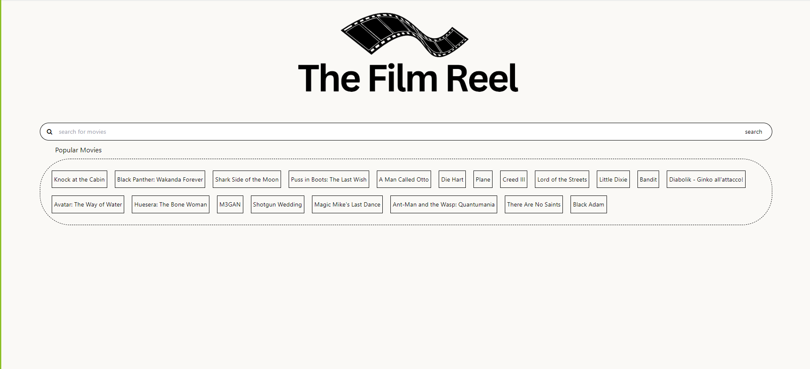

# The Film Reel
## *Getting all the details about the favorite movie and related GIFs for fun.*

# Description
The Film Reel is a coding project that aims to enhance users' movie experience by providing them with related GIFs based on the name of the searched movie. The website aims to provide movie enthusiasts with an engaging platform to discover new films using the TMBD and GIPHY APIs. Its ultimate goal is to give users a personalized experience to express their passion for cinema. The aim is to transform the method in which movie enthusiasts explore and relish GIFs by providing a dynamic and customized encounter.

## Table of Contents (Optional)

- [Installation](#installation)
- [Usage](#usage)
- [Credits](#credits)
- [License](#license)

## Installation
1. Sign up for free on TMDB and GIPHY to get your api keys.
2. Clone the repository or download the code as zip file.
3. Replace your api keys with the preloaded keys in the script.js file.
4. Open the index.html page with your browser to see the web app.

## Usage

## Credits

[Aleksandr Bausher](https://www.github.com/aleksandrbausher)

## License
MIT license
